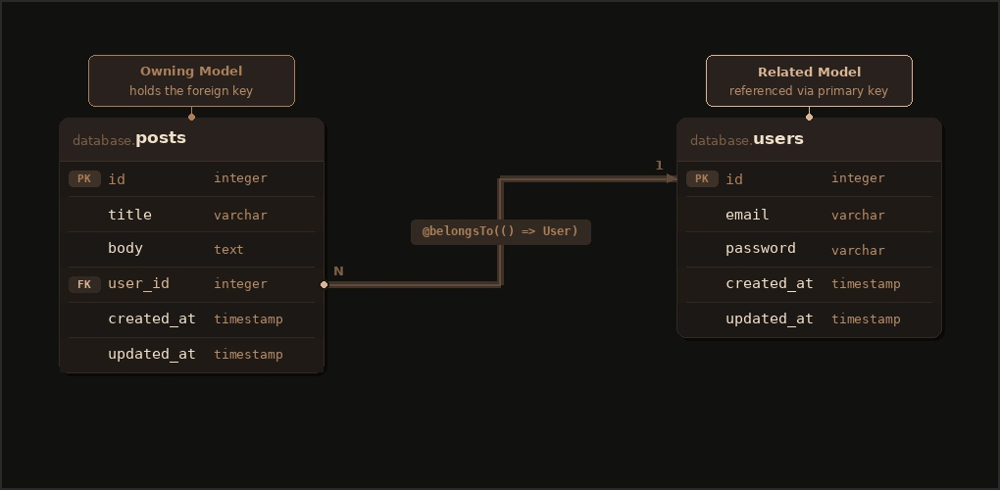

# Relationships

This guide is the conceptual landing for Lucid relationships. You will learn:

- What a relationship is in Lucid and how you declare one
- How Lucid names relationships and where they live in your code
- The available relationship types, with the database layout and model code for each

The detailed loading, querying, and writing APIs for each relationship type live on the per-relationship guides linked from the bottom of this page.

## Overview

A relationship connects one model to another through a shared column. You declare relationships once on your model classes and traverse them in code without writing joins by hand.

```ts
// title: app/models/user.ts
import { hasMany } from '@adonisjs/lucid/orm'
import type { HasMany } from '@adonisjs/lucid/types/relations'
import { UsersSchema } from '#database/schema'
import Post from '#models/post'

export default class User extends UsersSchema {
  @hasMany(() => Post)
  declare posts: HasMany<typeof Post>
}
```

```ts
// title: app/models/post.ts
import { belongsTo } from '@adonisjs/lucid/orm'
import type { BelongsTo } from '@adonisjs/lucid/types/relations'
import { PostsSchema } from '#database/schema'
import User from '#models/user'

export default class Post extends PostsSchema {
  @belongsTo(() => User)
  declare author: BelongsTo<typeof User>
}
```

Both sides are now connected. You can traverse the relationship from either direction.

```ts
const user = await User.query().preload('posts').firstOrFail()
console.log(user.posts)

const post = await Post.query().preload('author').firstOrFail()
console.log(post.author.email)
```

## How Lucid expresses relationships

A few conventions apply to every relationship you declare.

### Relationships live on the model

Relationships are declared in your model classes inside `app/models/`. They are not part of the generated schema class. Regenerating `database/schema.ts` never touches your relationships.

### Directional names

Relationships are named by which side holds the foreign key, not by row-count cardinality.

- Your model holds the foreign key. Use `belongsTo`.
- Another model's foreign key points at you and there is one row at most. Use `hasOne`.
- Another model's foreign key points at you and there can be many rows. Use `hasMany`.
- Two models share a pivot table that holds foreign keys to both. Use `manyToMany`.
- You reach the target model through an intermediate model. Use `hasManyThrough`.

The directional style reads consistently from both sides. `Post` belongs to a `User`, `User` has many `Post`. There is no ambiguity about where the foreign key lives.

### Function-based related model references

Related models are passed as a function returning the class.

```ts
@hasMany(() => Post)
declare posts: HasMany<typeof Post>
```

The function defers resolution of `Post` until after every module has loaded, which avoids circular import errors when two models reference each other.

### Overrides live on the decorator

Every decorator accepts an options object for key overrides when Lucid's defaults do not match your schema.

```ts
@belongsTo(() => User, { foreignKey: 'authorId' })
declare author: BelongsTo<typeof User>
```

Explicit overrides on each decorator are the canonical way to customize keys. They are searchable and make each relationship self-documenting.

## Relationship types

The shape of the migration and model for each available relationship type.

### BelongsTo

A post belongs to one user. The owning model holds a foreign key column that points at the related model's primary key.



```ts
// title: database/migrations/xxxx_create_posts_table.ts
import { BaseSchema } from '@adonisjs/lucid/schema'

export default class extends BaseSchema {
  async up() {
    this.schema.createTable('posts', (table) => {
      table.increments('id')
      table.string('title').notNullable()
      table.text('body')
      table
        .integer('user_id')
        .unsigned()
        .notNullable()
        .references('users.id')
        .onDelete('CASCADE')
      table.timestamps(true, true)
    })
  }
}
```

```ts
// title: app/models/post.ts
import { belongsTo } from '@adonisjs/lucid/orm'
import type { BelongsTo } from '@adonisjs/lucid/types/relations'
import { PostsSchema } from '#database/schema'
import User from '#models/user'

export default class Post extends PostsSchema {
  @belongsTo(() => User)
  declare author: BelongsTo<typeof User>
}
```

### HasOne

A user has one profile. The related model holds a foreign key column that points at the parent's primary key, and a unique index ensures only one row per parent.

<!-- Image placeholder: diagram of profiles.user_id referencing users.id with unique constraint, annotated one-to-one -->

```ts
// title: database/migrations/xxxx_create_profiles_table.ts
import { BaseSchema } from '@adonisjs/lucid/schema'

export default class extends BaseSchema {
  async up() {
    this.schema.createTable('profiles', (table) => {
      table.increments('id')
      table
        .integer('user_id')
        .unsigned()
        .notNullable()
        .unique()
        .references('users.id')
        .onDelete('CASCADE')
      table.string('display_name')
      table.text('bio')
      table.timestamps(true, true)
    })
  }
}
```

```ts
// title: app/models/user.ts
import { hasOne } from '@adonisjs/lucid/orm'
import type { HasOne } from '@adonisjs/lucid/types/relations'
import { UsersSchema } from '#database/schema'
import Profile from '#models/profile'

export default class User extends UsersSchema {
  @hasOne(() => Profile)
  declare profile: HasOne<typeof Profile>
}
```

### HasMany

A user has many posts. The related model holds a foreign key column that points at the parent's primary key, with no uniqueness constraint.

<!-- Image placeholder: diagram of posts.user_id referencing users.id, fanning arrows annotated one-to-many -->

```ts
// title: database/migrations/xxxx_create_posts_table.ts
import { BaseSchema } from '@adonisjs/lucid/schema'

export default class extends BaseSchema {
  async up() {
    this.schema.createTable('posts', (table) => {
      table.increments('id')
      table.string('title').notNullable()
      table.text('body')
      table
        .integer('user_id')
        .unsigned()
        .notNullable()
        .references('users.id')
        .onDelete('CASCADE')
      table.timestamps(true, true)
    })
  }
}
```

```ts
// title: app/models/user.ts
import { hasMany } from '@adonisjs/lucid/orm'
import type { HasMany } from '@adonisjs/lucid/types/relations'
import { UsersSchema } from '#database/schema'
import Post from '#models/post'

export default class User extends UsersSchema {
  @hasMany(() => Post)
  declare posts: HasMany<typeof Post>
}
```

### ManyToMany

A user has many skills, and each skill belongs to many users. A pivot table holds foreign keys to both sides. Neither model holds a direct foreign key to the other.

<!-- Image placeholder: diagram of User <-> user_skills pivot <-> Skill, annotated many-to-many with pivot attributes -->

```ts
// title: database/migrations/xxxx_create_user_skills_table.ts
import { BaseSchema } from '@adonisjs/lucid/schema'

export default class extends BaseSchema {
  async up() {
    this.schema.createTable('user_skills', (table) => {
      table.increments('id')
      table.integer('user_id').unsigned().notNullable().references('users.id').onDelete('CASCADE')
      table.integer('skill_id').unsigned().notNullable().references('skills.id').onDelete('CASCADE')
      table.unique(['user_id', 'skill_id'])
      table.timestamps(true, true)
    })
  }
}
```

```ts
// title: app/models/user.ts
import { manyToMany } from '@adonisjs/lucid/orm'
import type { ManyToMany } from '@adonisjs/lucid/types/relations'
import { UsersSchema } from '#database/schema'
import Skill from '#models/skill'

export default class User extends UsersSchema {
  @manyToMany(() => Skill)
  declare skills: ManyToMany<typeof Skill>
}
```

### HasManyThrough

A country has many posts through its users. The through model holds a foreign key to the parent, and the related model holds a foreign key to the through model.

<!-- Image placeholder: diagram of Country -> Users -> Posts chain with annotations for both foreign key columns -->

```ts
// title: database/migrations/xxxx_create_users_table.ts (excerpt)
table
  .integer('country_id')
  .unsigned()
  .notNullable()
  .references('countries.id')
  .onDelete('CASCADE')
```

```ts
// title: database/migrations/xxxx_create_posts_table.ts (excerpt)
table
  .integer('user_id')
  .unsigned()
  .notNullable()
  .references('users.id')
  .onDelete('CASCADE')
```

```ts
// title: app/models/country.ts
import { hasManyThrough } from '@adonisjs/lucid/orm'
import type { HasManyThrough } from '@adonisjs/lucid/types/relations'
import { CountriesSchema } from '#database/schema'
import Post from '#models/post'
import User from '#models/user'

export default class Country extends CountriesSchema {
  @hasManyThrough([() => Post, () => User])
  declare posts: HasManyThrough<typeof Post>
}
```

## Next steps

Each relationship type has its own guide that covers loading, querying, persisting, and the full option reference including foreign key overrides and the `onQuery` hook.

- [BelongsTo](./belongs_to.md) for the owning side of one-to-one and many-to-one relationships
- [HasMany](./has_many.md) for one-to-many from the referenced side
- [ManyToMany](./many_to_many.md) for pivot-backed many-to-many, including pivot columns, timestamps, and the attach, detach, and sync API
- [HasOne](./has_one.md) for one-to-one from the referenced side
- [HasManyThrough](./has_many_through.md) for traversing an intermediate model
